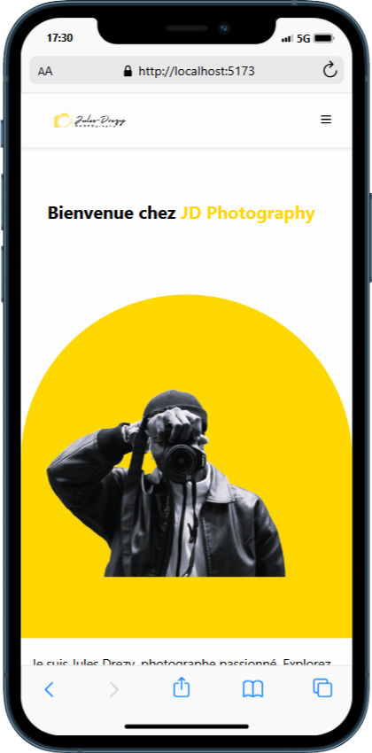

# 📸 JD Photography Portfolio

Bienvenue sur le **Portfolio de Jules Drezy** !  
Un site moderne, rapide et responsive pour présenter mes plus belles photos de mariage, portrait, nature, noir & blanc et plus encore.

---

## 🚀 Fonctionnalités

- Galerie interactive par catégories
- Carousel automatique et navigation manuelle
- Affichage plein écran des photos
- Formulaire de contact avec envoi d’email (EmailJS)
- Responsive mobile & desktop
- Footer avec liens réseaux sociaux

---

## 🗂️ Structure du projet

```
jd-photography/
├── public/
│   └── images/
│       └── clients/
│           └── [Categorie]/
├── src/
│   ├── components/
│   │   └── css/
│   └── pages/
│       └── Contact.jsx
├── package.json
├── README.md
└── ...
```

- **public/images/clients/[Categorie]/** : Ajoute tes propres photos dans les dossiers de catégories.
- **src/components/css/** : Personnalise les couleurs et le style dans les fichiers CSS.
- **src/pages/Contact.jsx** : Configure EmailJS ici pour le formulaire de contact.

---

## ⚡ Installation & Lancement

1. Installe les dépendances :
    ```bash
    npm install
    ```
2. Lance le serveur de développement :
    ```bash
    npm run dev
    ```
3. Ouvre [http://localhost:5173](http://localhost:5173) dans ton navigateur préféré.

---

## ✉️ Configuration EmailJS

Pour activer le formulaire de contact :

1. Crée un compte sur [EmailJS](https://www.emailjs.com/)
2. Récupère ton **Service ID**, **Template ID** et **Public Key**
3. Remplace-les dans `src/pages/Contact.jsx`

---

## 🌈 Astuces

- Les images doivent avoir les extensions exactes listées dans le code (`.jpg`, `.jpeg`, `.png`, ...)
- Personnalise le style selon tes envies dans les fichiers CSS.
- Toute suggestion ou PR est la bienvenue !

---

## 🖼️ Aperçu

**

---

Merci de visiter mon univers photographique !  
Développé par Jokast Kassa 🚀  
Jules Drezy 📷✨

